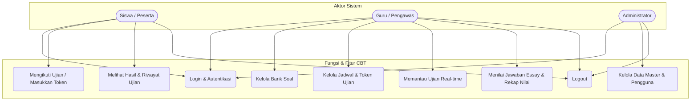
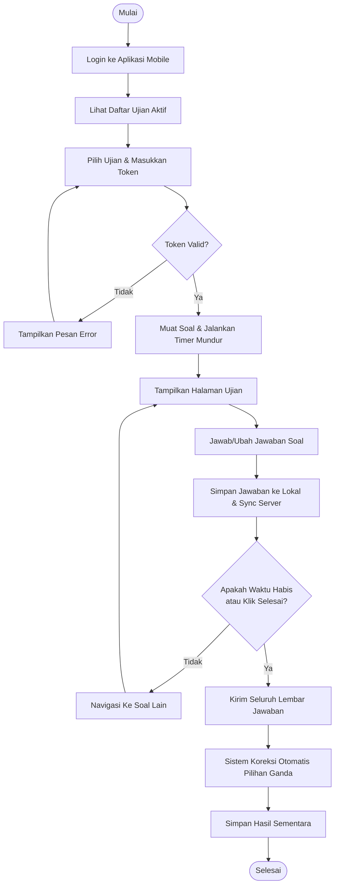
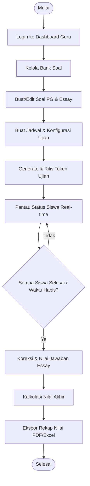
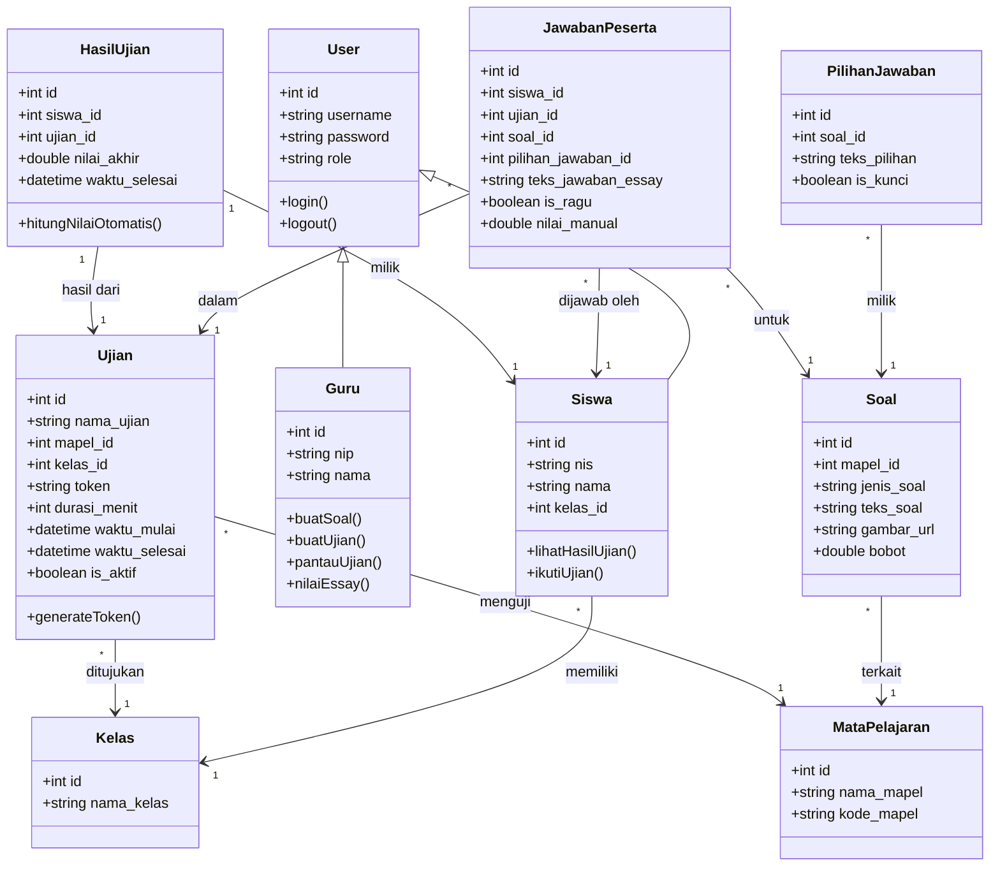

# Dokumen Analisis Sistem - Aplikasi Mobile CBT (Computer Based Test)

Dokumen ini berisi analisis sistem mendalam untuk proyek pengembangan aplikasi mobile **Computer Based Test (CBT)**. Analisis ini mencakup identifikasi kebutuhan sistem (fungsional & non-fungsional), Use Case Diagram, Activity Diagram, dan Class Diagram.

---

## 1. Identifikasi Kebutuhan Sistem

Tahap ini mengidentifikasi kebutuhan fungsional (apa saja fitur yang harus disediakan sistem) dan kebutuhan non-fungsional (batasan teknis, keamanan, performa, dan kegunaan sistem).

### A. Kebutuhan Fungsional (Functional Requirements)

| ID | Fitur Utama | Deskripsi Detail | Aktor Terkait |
| :--- | :--- | :--- | :--- |
| **F-01** | Autentikasi Pengguna | Sistem harus mendukung login/logout terenkripsi menggunakan username/email dan password. Hak akses dibagi menjadi Admin, Guru, dan Siswa. | Siswa, Guru, Admin |
| **F-02** | Manajemen Data Master | Admin dapat mengelola data pengguna (siswa & guru), data kelas, mata pelajaran, serta hak akses dalam sistem. | Admin |
| **F-03** | Manajemen Bank Soal | Guru dapat membuat, memperbarui, dan menghapus soal (Pilihan Ganda dan Essay). Soal dapat dilengkapi teks, bobot nilai, serta lampiran gambar. | Guru |
| **F-04** | Manajemen Ujian & Token | Guru dapat menjadwalkan ujian, mengasosiasikan bank soal, menetapkan durasi, mengatur kelas peserta, mengacak soal/jawaban, dan membuat token ujian. | Guru |
| **F-05** | Pengerjaan Ujian | Siswa dapat mengikuti ujian setelah memasukkan token valid. Halaman pengerjaan memiliki fitur navigasi soal (sebelumnya/berikutnya), penanda ragu-ragu, timer mundur, dan auto-save jawaban. | Siswa |
| **F-06** | Sinkronisasi Jawaban Offline | Aplikasi mobile dapat menyimpan jawaban sementara di lokal database perangkat saat koneksi internet tidak stabil, lalu mengirimkannya ketika terhubung kembali. | Siswa |
| **F-07** | Pemantauan Ujian Real-time | Guru dapat melihat status siswa yang sedang menempuh ujian (sedang mengerjakan, selesai, terlambat) secara real-time. | Guru |
| **F-08** | Penilaian & Rekap Nilai | Sistem melakukan penilaian otomatis untuk soal pilihan ganda. Guru dapat menilai jawaban essay secara manual. Hasil nilai akhir dapat diekspor ke format Excel/PDF. | Guru, Siswa |
| **F-09** | Riwayat Ujian | Siswa dapat melihat riwayat ujian yang telah diselesaikan beserta skor akhir (jika diizinkan oleh guru/instansi). | Siswa |

### B. Kebutuhan Non-Fungsional (Non-Functional Requirements)

| ID | Parameter | Kebutuhan Teknis / Operasional |
| :--- | :--- | :--- |
| **NF-01** | **Keamanan (Security)** | <ul><li>Password disimpan dengan enkripsi searah (hashing bcrypt/argon2).</li><li>Token JWT digunakan untuk autentikasi API session.</li><li>**Anti-Cheating:** Sistem mendeteksi jika aplikasi diminimalkan (backgrounded) atau siswa mencoba keluar dari layar ujian, lalu memberikan peringatan otomatis atau mengunci ujian.</li></ul> |
| **NF-02** | **Keandalan (Reliability)** | <ul><li>Data pengerjaan disinkronisasi setiap 10-15 detik ke server (auto-save).</li><li>Menggunakan SQLite/Hive di perangkat mobile untuk penyimpanan lokal transien agar data pengerjaan aman dari crash aplikasi.</li></ul> |
| **NF-03** | **Performa (Performance)** | <ul><li>Aplikasi mobile harus responsif dengan waktu muat soal di bawah 2 detik.</li><li>Server backend harus mampu menangani konkurensi tinggi ketika ratusan siswa memulai ujian secara bersamaan.</li></ul> |
| **NF-04** | **Usability & Portabilitas** | <ul><li>UI/UX dirancang ramah pengguna (clean design), responsif di berbagai ukuran layar smartphone, dengan font yang mudah dibaca.</li><li>Aplikasi dikembangkan menggunakan Flutter agar dapat dijalankan di platform Android dan iOS secara native.</li></ul> |

---

## 2. Use Case Diagram

Use Case Diagram menggambarkan interaksi antara aktor (Siswa, Guru, Admin) dengan fungsi-fungsi utama yang disediakan oleh sistem CBT.

---

## 3. Activity Diagram

Activity Diagram menjelaskan alur kerja (workflow) proses bisnis utama dalam sistem CBT. Di bawah ini disajikan dua alur utama: Alur Siswa Mengerjakan Ujian dan Alur Guru Mengelola & Memantau Ujian.

### A. Activity Diagram: Siswa Mengikuti Ujian

Diagram ini menunjukkan langkah-langkah yang dilalui siswa mulai dari login hingga mengirimkan jawaban ujian.

### B. Activity Diagram: Guru Mengelola Bank Soal & Memantau Ujian

Diagram ini menjelaskan alur kerja guru dalam menyusun soal, merilis ujian, memantau pengerjaan secara real-time, hingga merekap nilai.

---

## 4. Class Diagram

Class Diagram menggambarkan struktur statis sistem dengan memperlihatkan kelas-kelas objek, atribut, metode, serta hubungan antar kelas.

